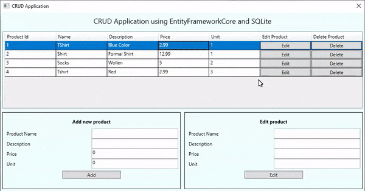

# wpfcrudefcoresqlite

Sample project to implement CRUD operations in a WPF Core application using EntityFrameworkCore and SQLite as a backend database.

The complete details can be found at the blog post: https://executecommands.com/crud-operations-in-wpf-efcore-sqlite-net-core/
